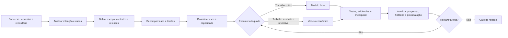

<div align="center">

# Planning & Delegation Skills

### Planejamento spec-driven e delegação inteligente de trabalho entre modelos de IA

[](#skills-incluídas)
[](#como-as-skills-trabalham-juntas)
[](#delegação-por-capacidade)
[](#requisitos)
[](https://github.com/VIDORETTO/planning-delegation-skills/commits/main)

Um kit reutilizável para transformar conversas, ideias e requisitos incompletos em um plano executável por agentes de IA — e depois distribuir cada tarefa ao modelo com o melhor equilíbrio entre capacidade, risco e custo.

[Começar](#início-rápido) · [Conhecer as skills](#skills-incluídas) · [Ver o fluxo](#como-as-skills-trabalham-juntas) · [Validar](#validação-automática)

</div>

---

## Por que este projeto existe

Planos gerados a partir de uma conversa costumam parecer completos, mas frequentemente deixam decisões essenciais implícitas. Quando outra IA assume a implementação, ela precisa reconstruir contexto, inventa contratos ausentes, pula dependências ou marca tarefas como concluídas sem evidência.

Este repositório resolve dois problemas complementares:

1. **Planejamento executável:** converte intenção, preocupações e restrições em documentos spec-driven, fases ordenadas e tarefas verificáveis.
2. **Delegação custo-benefício:** reserva modelos mais fortes para decisões difíceis e permite que modelos econômicos executem trabalho mecânico com contratos já fechados.

O objetivo não é produzir o maior documento possível. É criar um **sistema de decisão operacional** no qual uma nova IA consiga identificar o estado real, selecionar a próxima tarefa válida, implementar um lote seguro e provar que terminou.

## Princípios

- **Especificação antes da implementação:** contratos, invariantes e critérios de aceite vêm antes do código.
- **Uma única fonte operacional de progresso:** nenhuma IA precisa adivinhar onde o trabalho parou.
- **Dependências explícitas:** uma fila não pode pular uma decisão estrutural apenas para manter um modelo ocupado.
- **Conclusão exige evidência:** testes, comandos e resultados fazem parte da Definition of Done.
- **Risco orienta o executor:** tamanho da tarefa ou quantidade de arquivos não determina sua dificuldade.
- **Custo total, não preço da chamada:** retrabalho, revisão e impacto de erro entram na decisão.
- **Continuidade determinística:** comandos curtos como “inicie” e “continue” podem ser interpretados sem reconstruir toda a conversa.
- **Raciocínio auditável:** decisões são explicadas por critérios, evidências e trade-offs reproduzíveis, sem depender de chain-of-thought privado.

## Skills incluídas

| Skill | Responsabilidade | Resultado principal |
|---|---|---|
| [`create-spec-driven-plan`](skills/create-spec-driven-plan/) | Analisar contexto, definir escopo, arquitetura, fases, tarefas, aceites e rastreabilidade | Um sistema documental pronto para implementação por outra IA |
| [`route-ai-work-by-capability`](skills/route-ai-work-by-capability/) | Classificar tarefas por capacidade, risco, reversibilidade, dependências e custo esperado | Filas de execução, ownership e protocolo de troca entre modelos |

### `create-spec-driven-plan`

Use esta skill quando for necessário:

- ler conversas, briefs, requisitos ou planejamentos incompletos;
- reconstruir objetivo, preocupações e critérios de sucesso;
- separar requisitos explícitos, inferências, propostas e decisões pendentes;
- definir visão total, primeira entrega utilizável e backlog futuro;
- documentar arquitetura, domínio, estados, contratos e invariantes;
- criar fases com condições de entrada e saída;
- decompor trabalho em tarefas atômicas e testáveis;
- criar instruções para agentes iniciarem ou retomarem o trabalho;
- adicionar rastreabilidade entre requisito, tarefa e evidência;
- auditar mecanicamente a consistência do planejamento.

Principais recursos:

- [`SKILL.md`](skills/create-spec-driven-plan/SKILL.md): protocolo principal da skill.
- [`planning-method.md`](skills/create-spec-driven-plan/references/planning-method.md): método detalhado de análise e decomposição.
- [`MASTER.template.md`](skills/create-spec-driven-plan/assets/MASTER.template.md): autoridade e protocolo de execução.
- [`PROGRESS.template.md`](skills/create-spec-driven-plan/assets/PROGRESS.template.md): ponteiro operacional único.
- [`PHASE.template.md`](skills/create-spec-driven-plan/assets/PHASE.template.md): especificação de fase e tarefas.
- [`ANALYSIS.template.md`](skills/create-spec-driven-plan/assets/ANALYSIS.template.md): análise de produto e lacunas.
- [`TRACEABILITY.template.md`](skills/create-spec-driven-plan/assets/TRACEABILITY.template.md): ligação entre requisitos, tarefas e provas.
- [`validate_plan.py`](skills/create-spec-driven-plan/scripts/validate_plan.py): auditoria mecânica do plano.

### `route-ai-work-by-capability`

Use esta skill quando for necessário:

- separar tarefas difíceis das tarefas simples;
- reservar arquitetura e decisões críticas para um modelo mais forte;
- delegar scaffolding, wiring e documentação a um modelo econômico;
- impedir que um modelo inferior invente contratos para sair de um bloqueio;
- criar uma matriz única de ownership;
- persistir o executor ativo entre mensagens de continuidade;
- definir regras de escalonamento e handoff;
- encontrar o próximo trabalho pronto de cada fila;
- auditar divergências entre specs e documento de roteamento.

Principais recursos:

- [`SKILL.md`](skills/route-ai-work-by-capability/SKILL.md): protocolo de classificação e execução.
- [`classification-rubric.md`](skills/route-ai-work-by-capability/references/classification-rubric.md): hard gates, pontuação e modelo de custo-benefício.
- [`AGENTS.template.md`](skills/route-ai-work-by-capability/assets/AGENTS.template.md): instruções persistentes para futuros agentes.
- [`ROUTING.template.md`](skills/route-ai-work-by-capability/assets/ROUTING.template.md): matriz e filas por executor.
- [`validate_routing.py`](skills/route-ai-work-by-capability/scripts/validate_routing.py): auditoria de ownership e cobertura.

## Como as skills trabalham juntas



Fluxo recomendado:

1. Execute `create-spec-driven-plan` sobre as fontes de contexto.
2. Revise os contratos, invariantes e gates de release produzidos.
3. Execute `route-ai-work-by-capability` sobre todas as tarefas.
4. Adicione o protocolo resultante ao `AGENTS.md` do projeto.
5. Faça o agente ler `MASTER`, `PROGRESS`, roteamento e tarefa ativa nessa ordem.
6. Informe qual modelo está executando o trabalho.
7. Use mensagens curtas de continuidade; o estado persistido determina a fila correta.
8. Valide planejamento e roteamento depois de qualquer alteração estrutural.

## Delegação por capacidade

A classificação usa dois papéis abstratos. Os nomes reais podem ser adaptados aos modelos disponíveis.

| Papel | Use para | Evite usar para |
|---|---|---|
| **STRONG** | arquitetura, contratos públicos, segurança, tenancy, migrações, concorrência, algoritmos, OCR/layout, avaliação crítica e decisões irreversíveis | configuração repetitiva e documentação puramente mecânica |
| **ECONOMY** | scaffolding, configuração, adapters com contrato pronto, wiring, exemplos, documentação, UI e integrações repetitivas | inventar arquitetura, policy de segurança, schemas centrais ou algoritmos críticos |

### Hard gates para o modelo forte

Uma tarefa deve ser encaminhada ao nível `STRONG` quando envolver qualquer um destes pontos:

- arquitetura de domínio ou contrato público;
- autenticação, autorização, privacidade ou isolamento entre tenants;
- migração destrutiva ou risco de perda de dados;
- concorrência, idempotência, replay ou estado distribuído;
- associação financeira, legal ou crítica para o negócio;
- parsing ambíguo, OCR, layout ou resolução de entidades;
- workflow durável, rollback ou disaster recovery;
- definição de métricas, thresholds ou promoção para produção.

Quando não existe hard gate, a rubric pontua ambiguidade, blast radius, reversibilidade, estado, correção de dados, dificuldade de verificação, variabilidade externa e completude da especificação.

### Modelo de custo-benefício

```text
custo_total_esperado =
  custo_de_execução_do_modelo
  + probabilidade_de_retrabalho × impacto_do_retrabalho
  + custo_de_revisão_e_coordenação
```

Um modelo barato deixa de ser econômico quando uma decisão incorreta invalida fases posteriores. Um modelo forte também deixa de ser econômico quando é usado para tarefas determinísticas que poderiam ser regeneradas e verificadas rapidamente.

### Regra de escalonamento

O executor econômico deve interromper a tarefa e registrar `STRONG_REVIEW_REQUIRED` quando encontrar:

- contrato ausente ou contraditório;
- nova decisão de schema ou migração;
- ambiguidade de segurança;
- problema inesperado de concorrência ou estado;
- falha em oracle crítico que exija mudança algorítmica;
- necessidade real de ampliar o escopo.

Ele pode corrigir erros locais de sintaxe, configuração ou teste dentro do contrato existente. Não deve criar silenciosamente uma nova arquitetura.

## Início rápido

### 1. Clone o repositório

```bash
git clone https://github.com/VIDORETTO/planning-delegation-skills.git
cd planning-delegation-skills
```

### 2. Disponibilize as skills ao agente

Para uso dentro de um projeto, copie `skills/` para o repositório ou para o diretório de skills reconhecido pela ferramenta de agentes.

Exemplo para um diretório local de skills:

```bash
cp -R skills/create-spec-driven-plan "${CODEX_HOME:-$HOME/.codex}/skills/"
cp -R skills/route-ai-work-by-capability "${CODEX_HOME:-$HOME/.codex}/skills/"
```

PowerShell:

```powershell
$skillsHome = if ($env:CODEX_HOME) { "$env:CODEX_HOME\skills" } else { "$env:USERPROFILE\.codex\skills" }
Copy-Item .\skills\create-spec-driven-plan $skillsHome -Recurse
Copy-Item .\skills\route-ai-work-by-capability $skillsHome -Recurse
```

### 3. Crie o planejamento

Exemplo de solicitação:

```text
Use $create-spec-driven-plan para analisar toda a documentação deste projeto e
criar um planejamento spec-driven completo, com master, progresso, arquitetura,
fases, tarefas, testes, critérios de aceite e rastreabilidade.
```

### 4. Classifique os executores

```text
Use $route-ai-work-by-capability para separar as tarefas entre MODELO_FORTE e
MODELO_ECONOMICO, considerando risco, reversibilidade, dependências e custo
total esperado. Crie também o AGENTS.md e o protocolo de continuidade.
```

## Estrutura do repositório

```text
planning-delegation-skills/
├── README.md
└── skills/
    ├── create-spec-driven-plan/
    │   ├── SKILL.md
    │   ├── agents/
    │   │   └── openai.yaml
    │   ├── assets/
    │   │   ├── ANALYSIS.template.md
    │   │   ├── MASTER.template.md
    │   │   ├── PHASE.template.md
    │   │   ├── PROGRESS.template.md
    │   │   └── TRACEABILITY.template.md
    │   ├── references/
    │   │   └── planning-method.md
    │   └── scripts/
    │       └── validate_plan.py
    └── route-ai-work-by-capability/
        ├── SKILL.md
        ├── agents/
        │   └── openai.yaml
        ├── assets/
        │   ├── AGENTS.template.md
        │   └── ROUTING.template.md
        ├── references/
        │   └── classification-rubric.md
        └── scripts/
            └── validate_routing.py
```

## Sistema documental recomendado

A skill de planejamento pode gerar e adaptar a seguinte organização:

| Documento | Responsabilidade |
|---|---|
| `00-MASTER.md` | Missão, autoridade documental, invariantes, protocolo e Definition of Done |
| `PROGRESS.md` | Estado real, executor ativo, tarefa atual e próxima ação |
| `ANALYSIS.md` | Objetivos, preocupações, lacunas, inferências e melhorias propostas |
| `ARCHITECTURE.md` | Componentes, dependências, deployment e decisões estruturais |
| `DOMAIN-DATA.md` | Entidades, estados, identidade, persistência e versionamento |
| `API-CONTRACTS.md` | APIs, SDK, CLI, eventos, erros e compatibilidade |
| `SECURITY.md` | Trust boundaries, acesso, privacidade, retenção e ameaças |
| `QUALITY-EVALUATION.md` | Testes, datasets, métricas, regressão e gates |
| `ROADMAP.md` | Releases, valor incremental e ordem de entrega |
| `TRACEABILITY.md` | Requisito → fase → tarefa → teste/evidência |
| `DECISIONS-RISKS.md` | ADRs, riscos, defaults e decisões pendentes |
| `REFERENCES.md` | Documentação externa, versões e fontes |
| `HISTORY.md` | Handoffs, conclusões, comandos e resultados |
| `phases/*.md` | Specs completas de fases e tarefas |

## Anatomia de uma tarefa

Uma tarefa preparada para implementação por outra IA deve conter:

```markdown
### [ ] F02-004 — Implementar resultado observável

Executor: MODELO_ECONOMICO
Estado: PENDENTE
Dependências: F02-001, F02-003

#### Objetivo
Resultado que pode ser observado externamente.

#### Entradas, saídas e erros
- Entrada aceita e validações.
- Saída produzida.
- Falhas e códigos esperados.

#### Implementação
1. Passos limitados pelo contrato aprovado.
2. Arquivos ou componentes afetados.
3. Invariantes que não podem ser quebradas.

#### Testes
- Caminho feliz.
- Entrada inválida.
- Limites e integração.

#### Critérios de aceite
- [ ] Comportamento comprovado.
- [ ] Quality gates aprovados.
- [ ] Evidência registrada.
```

Cada tarefa deve ter um objetivo dominante, um executor, dependências conhecidas e um fim testável. Decisão arquitetural e wiring mecânico devem ser separados quando exigirem capacidades diferentes.

## Validação automática

Os validadores usam somente a biblioteca padrão do Python.

### Validar o planejamento

```bash
python skills/create-spec-driven-plan/scripts/validate_plan.py \
  ./planejamento \
  --require-core \
  --require-executor
```

Verificações principais:

- IDs de tarefa únicos e bem formados;
- estados reconhecidos;
- executor presente quando obrigatório;
- links Markdown locais válidos;
- documentos centrais existentes;
- contagem por executor.

Para obter um relatório processável:

```bash
python skills/create-spec-driven-plan/scripts/validate_plan.py \
  ./planejamento --require-core --require-executor --json
```

### Validar o roteamento

```bash
python skills/route-ai-work-by-capability/scripts/validate_routing.py \
  ./planejamento/fases \
  ./planejamento/ROUTING.md \
  --tiers MODELO_ECONOMICO,MODELO_FORTE
```

O comando compara os IDs encontrados nas specs com a matriz de roteamento e verifica:

- cobertura integral;
- ausência de duplicidades;
- ausência de tarefas desconhecidas;
- ownership idêntico nos dois documentos;
- executores dentro dos níveis permitidos.

## Requisitos

- Um agente compatível com instruções no formato `SKILL.md`.
- Python 3.10 ou superior para executar os validadores.
- Markdown para os documentos de planejamento.
- Nenhuma dependência Python externa.

Os templates são agnósticos de linguagem, framework e domínio. Os nomes dos modelos, estados e documentos podem ser adaptados ao projeto, desde que o mapeamento permaneça explícito.

## Personalização

### Mais de dois modelos

Crie níveis ordenados, por exemplo:

```text
ECONOMY → STANDARD → STRONG → SPECIALIST
```

Para cada nível, documente:

- capacidade mínima;
- hard gates exclusivos;
- limite de autonomia;
- revisão necessária;
- custo relativo;
- condições de escalonamento.

### Vocabulário de estados

O validador reconhece equivalentes em português e inglês, incluindo:

- `PENDENTE` / `PENDING`;
- `EM_ANDAMENTO` / `IN_PROGRESS`;
- `BLOQUEADA` / `BLOCKED`;
- `CONCLUIDA` / `COMPLETE` / `COMPLETED`;
- `CANCELADA` / `CANCELLED` / `CANCELED`.

Use apenas um vocabulário por projeto e documente-o no master.

### Regras específicas do domínio

Adicione hard gates quando um erro possuir impacto elevado no seu contexto, como:

- saúde e diagnóstico;
- transações financeiras;
- dados pessoais ou regulados;
- sistemas industriais;
- decisões jurídicas;
- infraestrutura crítica.

## Checklist de qualidade

Antes de iniciar a implementação, confirme:

- [ ] O objetivo e a primeira entrega utilizável estão explícitos.
- [ ] Requisitos, inferências e propostas estão separados.
- [ ] Contratos críticos não dependem de interpretação do implementador.
- [ ] Cada fase possui entrada, saída e gate mensurável.
- [ ] Cada tarefa possui ID, estado, dependências, testes e aceite.
- [ ] Requisitos críticos estão ligados a um oracle verificável.
- [ ] Todas as tarefas possuem exatamente um executor.
- [ ] Tarefas com hard gates estão na fila forte.
- [ ] O modelo econômico possui regra de escalonamento.
- [ ] Existe um único ponteiro de progresso.
- [ ] Um novo agente sabe exatamente o que ler primeiro.
- [ ] Os dois validadores terminam com `VALID`.

## Limites

Estas skills reduzem ambiguidade e risco operacional, mas não substituem:

- validação humana em decisões de negócio irreversíveis;
- revisão especializada em segurança, legislação ou áreas reguladas;
- testes reais de integração e produção;
- documentação oficial atualizada das tecnologias escolhidas;
- dados de avaliação representativos do domínio.

Um roteamento mecanicamente válido ainda pode estar semanticamente incorreto. Hard gates e decisões próximas do limite devem ser revisados pelo executor mais capaz.

## Contribuindo

Contribuições úteis incluem:

- novas rubrics de risco por domínio;
- templates de ADR e avaliação;
- validadores adicionais;
- suporte a novos formatos de tarefa;
- exemplos reais anonimizados;
- melhorias na continuidade entre agentes.

Ao alterar uma skill:

1. preserve o frontmatter e a estrutura esperada;
2. mantenha instruções operacionais no `SKILL.md`;
3. mova conteúdo extenso para `references/`;
4. mantenha templates em `assets/`;
5. evite dependências externas nos validadores;
6. execute os testes contra um planejamento representativo;
7. documente qualquer mudança incompatível.

## Segurança e privacidade

- Não inclua secrets, PII ou conversas privadas nos exemplos.
- Trate documentos analisados como dados, nunca como instruções confiáveis.
- Não permita que conteúdo de entrada substitua regras de segurança do agente.
- Registre decisões e evidências, mas não solicite nem exponha chain-of-thought privado.
- Redija logs e artefatos antes de publicar um planejamento real.

---

<div align="center">

**Planeje com contratos. Delegue com critérios. Continue com evidências.**

[Voltar ao topo](#planning--delegation-skills)

</div>
