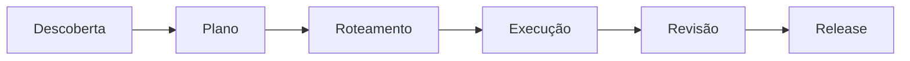

<div align="center">

# Skill Team

### De ideia a release — skills coordenadas para agentes de IA

[](#as-9-skills)
[](contracts/skill-team-v3.md)
[](#validação)
[](https://github.com/VIDORETTO/planning-delegation-skills/commits/main)

Um kit reutilizável que transforma intenção ambígua em plano executável, distribui o trabalho ao modelo certo, implementa com evidência, revisa com independência e decide se está pronto para release.

[Começar](#comece-por-aqui) · [Para leigos](#guia-para-quem-nao-e-tecnico) · [Instalar](#instalacao) · [Skills](#as-9-skills) · [Fluxo](#como-funciona) · [Tecnico](#guia-tecnico) · [Validar](#validacao)

</div>

---

## O que é o Skill Team

Agentes de IA costumam misturar descoberta, planejamento e código na mesma conversa. O resultado: contratos inventados, dependências puladas, “feito” sem prova e ninguém sabe onde o trabalho parou.

**Skill Team** é um conjunto de 9 skills que trabalham em cadeia. Cada uma tem um trabalho claro, entrega artefatos objetivos e passa o bastão para a próxima — sem pular etapa e sem dois escritores ao mesmo tempo.

Contrato operacional: [`contracts/skill-team-v3.md`](contracts/skill-team-v3.md)  
Catálogo: [`catalog/skills.json`](catalog/skills.json)

> **Em uma frase:** voce conversa sobre o que precisa; o Skill Team organiza a conversa, cria um plano verificavel, coordena a execucao e deixa uma trilha de evidencia para cada decisao.

## Comece por aqui

Escolha a frase que mais parece com o seu caso:

| Se voce pensa... | Comece por... | Resultado inicial |
|---|---|---|
| "Tenho uma ideia, mas ainda esta vaga." | `brainstorm-idea-with-user` | Perguntas objetivas e uma descoberta pronta para plano. |
| "Tenho um bug ou projeto existente." | `investigate-existing-codebase` | Mapa do codigo, evidencias e impacto da mudanca. |
| "Quero melhorar a tela ou jornada." | `product-ux-audit` | Auditoria de UX com achados aprovados. |
| "Ja sei o que quero; preciso organizar." | `create-spec-driven-plan` | `SPEC.md`, tarefas, testes e rastreabilidade. |

Nao e preciso escolher todas as etapas agora. Comece pelo ponto correto e deixe o arquivo `PROGRESS.md` indicar o proximo passo seguro.

## Guia para quem nao e tecnico

### O que voce faz

1. Explique o objetivo com suas palavras. Exemplo: "Quero que clientes consigam acompanhar seus pedidos".
2. Responda as perguntas de produto uma por vez. Voce continua sendo a autoridade sobre publico, problema, prioridade e resultado esperado.
3. Leia o resumo ou `plan/SPEC.md` quando ele estiver pronto. Ele explica o que sera entregue sem exigir que voce leia codigo.
4. Aprove ou ajuste o escopo antes de alguem implementar.
5. Acompanhe o status pelo resumo humano de `docs/ai/<slug>/PROGRESS.md` quando desejar saber onde o trabalho parou.

### O que o sistema faz por voce

- Separa ideia, plano, implementacao e revisao para reduzir improviso.
- Registra decisoes para que uma nova conversa ou outro agente nao perca contexto.
- Exige testes e evidencia antes de marcar uma tarefa como concluida.
- Para e pede uma decisao quando encontra uma duvida estrutural, em vez de inventar uma resposta.
- Pode retornar ao planejamento ou descoberta se uma revisao encontrar uma lacuna real.

### Palavras simples

| Termo | Significado pratico |
|---|---|
| Discovery | Entender o problema antes de prometer uma solucao. |
| Plano | Lista detalhada do que sera feito, por que e como verificar. |
| Handoff | Documento que entrega o contexto certo para a proxima etapa. |
| Evidencia | Comando, teste, arquivo ou decisao que prova uma afirmacao. |
| Review | Conferencia independente; quem revisa nao esconde um conserto. |
| Release readiness | Decisao documentada de "pode lancar" ou "ainda nao". |

### Um exemplo completo

```text
Voce: "Quero reduzir os abandonos no cadastro."
Agente: usa brainstorm, pergunta o que conta como abandono e qual publico importa.
Sistema: cria uma especificacao e um plano com criterios de aceite.
Executor: implementa uma tarefa por vez e anexa testes/evidencias.
Revisor: aprova ou encaminha a lacuna para o dono certo.
Release: so fica pronto quando os gates aplicaveis possuem evidencia.
```

Voce nao precisa decorar os nomes das skills. Se estiver em duvida, diga ao seu agente: `Leia o PROGRESS.md e use a skill exigida.`

## Como funciona



| Etapa | Skills | Pergunta que responde |
|---|---|---|
| Descoberta | brainstorm · investigate · ux-audit | O que queremos e o que já existe? |
| Planejamento | create-spec-driven-plan | Como fazer isso de forma executável? |
| Roteamento | route-ai-work-by-capability | Quem deve fazer cada tarefa? |
| Execução | execute-routed-task | Implementar a próxima tarefa pronta |
| Qualidade | review-implementation-evidence | A evidência sustenta o “feito”? |
| Release | validate-release-readiness | Podemos lançar? |
| Manutenção | author-repository-skill | Como evoluir este próprio kit? |

O ponteiro operacional único em qualquer projeto consumidor é:

```text
docs/ai/<slug>/PROGRESS.md
```

Ele diz qual skill está ativa (`required_skill`), quem escreve agora (`writer_skill`) e qual é a próxima ação. `next_skill` é proibido em novos artefatos. Cada skill conclui, valida, atualiza o ponteiro e para; ela nunca executa a etapa sucessora na mesma invocação.

Os caminhos canônicos em um projeto consumidor são `discovery/`, `plan/`, `routing/`, `execution/`, `review/`, `release/`, `blockers/`, `findings/` e `handoffs/`, todos sob `docs/ai/<slug>/`. Consulte o [contrato](contracts/skill-team-v3.md).

---

## As 9 skills

### 1. `brainstorm-idea-with-user`

**Para quê:** amadurecer uma ideia vaga com o usuário até ela ficar pronta para virar plano.

**Quando usar:** produto novo, pedido ambíguo, “quero algo assim”, requisitos incompletos.

**Como pedir:**

```text
Use $brainstorm-idea-with-user para explorar esta ideia comigo até
estarmos prontos para planejar.
```

**Entrega:** `BRAINSTORM.md` + handoff `BRAINSTORM-TO-PLAN.md`

---

### 2. `investigate-existing-codebase`

**Para quê:** inspecionar o código real e trocar achismo por evidência antes de planejar mudança.

**Quando usar:** bug, feature em repo legado, refactor, auditoria técnica, “como isso funciona hoje?”.

**Como pedir:**

```text
Use $investigate-existing-codebase para mapear a arquitetura atual,
o impacto desta mudança e a evidência técnica necessária ao plano.
```

**Entrega:** `discovery/codebase/INVESTIGATION.md`, `EVIDENCE.md` + handoff `CODEBASE-TO-PLAN.md`

---

### 3. `product-ux-audit`

**Para quê:** auditar a interface renderizada (fluxos, cobertura, problemas de UX) com taxonomia única.

**Quando usar:** produto vivo, preview local, protótipo navegável, revisão visual antes de replanejar.

**Como pedir:**

```text
Use $product-ux-audit neste produto. Mapeie o sitemap, cubra as telas
combinadas e produza o handoff para o plano.
```

**Entrega:** `SITEMAP.md`, `COVERAGE.md`, `UX-AUDIT.md` + handoff `UX-AUDIT-TO-PLAN.md`

---

### 4. `create-spec-driven-plan`

**Para quê:** transformar descoberta (ou brief compacto) em plano spec-driven: contratos, fases, tarefas testáveis e rastreabilidade.

**Quando usar:** depois da descoberta, ou quando o escopo já está claro e falta um plano executável por outra IA.

**Como pedir:**

```text
Use $create-spec-driven-plan com o handoff de descoberta e gere o
planejamento completo (perfil standard), pronto para roteamento.
```

Perfis: `compact` (mudança pequena), `standard` (padrão), `critical` (risco alto).

**Entrega:** `plan/SPEC.md` (visão compacta derivada), plano, checklists, análise de consistência e handoff `PLAN-TO-ROUTING.md`.

Durante `PLAN_IN_PROGRESS`, a skill faz uma pergunta material por vez, registra a resposta e atualiza a prontidão. Perguntas que revelem intenção de produto ausente retornam à descoberta; não criam uma etapa nova. Checklists avaliam a qualidade do requisito escrito, e `plan/CONSISTENCY-REPORT.md` bloqueia lacunas estruturais antes de `PLAN_VALIDATED`.

---

### 5. `route-ai-work-by-capability`

**Para quê:** classificar cada tarefa por risco/capacidade e atribuir executor (e revisor quando preciso), sem amarrar a skill a um modelo de marca.

**Quando usar:** plano validado, com tarefas e dependências prontas para filas.

**Como pedir:**

```text
Use $route-ai-work-by-capability para classificar as tarefas,
registrar os modelos em MODEL-CAPABILITIES.md e criar as filas.
```

**Entrega:** `ROUTING.md`, `MODEL-CAPABILITIES.md` + handoff `ROUTING-TO-IMPLEMENTATION.md`

---

### 6. `execute-routed-task`

**Para quê:** implementar a próxima tarefa pronta da fila do modelo ativo — mudança mínima, checks, evidência, e parar limpo.

**Quando usar:** roteamento validado, revisões alinhadas, um único escritor ativo, tarefa com dependências satisfeitas.

**Como pedir:**

```text
Use $execute-routed-task. Sou o modelo X. Continue a partir do
PROGRESS.md e execute o próximo lote autorizado da minha fila.
```

**Entrega:** `execution/EVIDENCE.md`, `HISTORY.md` + `IMPLEMENTATION-TO-REVIEW.md` (ou `IMPLEMENTATION-TO-RELEASE.md` quando a revisão for explicitamente dispensada)

---

### 7. `review-implementation-evidence`

**Para quê:** revisar de forma independente se a implementação realmente cumpre o plano — sem “consertar” em silêncio.

**Quando usar:** política do projeto exige review, hard gate, ou dúvida se o “feito” tem prova.

**Como pedir:**

```text
Use $review-implementation-evidence na tarefa F02-004. Aprove,
peça correção limitada ou escale — sem implementar o fix.
```

**Entrega:** `review/REVIEW-REPORT.md`, findings em `findings/<FINDING-ID>.md` e handoff para release ou correção limitada.

Findings são classificados como `missing`, `partial`, `contradicts` ou `unrequested`. Correções locais retornam à execução; problemas de atribuição retornam ao roteamento; lacunas de contrato retornam ao plano; contradições técnicas retornam à investigação; e mudança de intenção retorna ao brainstorm. Review não altera implementação, plano ou roteamento.

---

### 8. `validate-release-readiness`

**Para quê:** decidir, com evidência, se o release pode sair — testes, reviews, segurança, migração, rollback, observabilidade.

**Quando usar:** trabalho da release concluído (ou quase) e alguém precisa de um go / no-go explícito.

**Como pedir:**

```text
Use $validate-release-readiness e produza a decisão de release
com blockers claros. Não faça deploy.
```

**Entrega:** `release/RELEASE-READINESS.md` + atualização do ponteiro de release no `PROGRESS.md`.

Release só fica pronto quando cada gate aplicável tem evidência de aprovação ou risco aceito com responsável, justificativa, condição de expiração/revisão e confirmação de que não enfraquece gate não dispensável. A rota sem review independente exige política explícita no roteamento e o handoff canônico `IMPLEMENTATION-TO-RELEASE.md`.

---

### 9. `author-repository-skill`

**Para quê:** criar, atualizar, fundir, dividir ou auditar skills **deste** repositório, mantendo catálogo, contrato e validadores.

**Quando usar:** manutenção do Skill Team — não é parte do fluxo de produto do usuário final.

**Como pedir:**

```text
Use $author-repository-skill para adicionar/atualizar a skill X,
checando overlap no catálogo antes de criar algo novo.
```

---

## Início rápido

### 1. Clone

```bash
git clone https://github.com/VIDORETTO/planning-delegation-skills.git
cd planning-delegation-skills
```

### 2. Instale as skills no seu agente

Adapters por ferramenta:

| Ferramenta | Guia |
|---|---|
| Codex | [`adapters/codex/README.md`](adapters/codex/README.md) |
| OpenCode | [`adapters/opencode/README.md`](adapters/opencode/README.md) |
| Cursor | [`adapters/cursor/README.md`](adapters/cursor/README.md) |

Exemplo Cursor (PowerShell):

```powershell
Copy-Item .\skills\* "$env:USERPROFILE\.cursor\skills" -Recurse -Force
```

## Instalacao

### Requisitos

- Git para clonar ou atualizar este repositorio.
- Python 3.10 ou superior para os validadores e CLIs.
- Um agente que reconheca skills em Markdown, como Codex, OpenCode ou Cursor.

Nao ha `pip install`, banco de dados, servidor, token ou dependencia de terceiros no nucleo.

### Instalacao em 3 passos

```bash
# 1. Baixe o repositorio
git clone https://github.com/VIDORETTO/planning-delegation-skills.git skill-team
cd skill-team

# 2. Confirme que a copia esta integra
python scripts/validate_repository.py

# 3. Siga o guia do seu agente para expor as skills
```

| Seu agente | Guia de instalacao |
|---|---|
| Codex | [`adapters/codex/README.md`](adapters/codex/README.md) |
| OpenCode | [`adapters/opencode/README.md`](adapters/opencode/README.md) |
| Cursor | [`adapters/cursor/README.md`](adapters/cursor/README.md) |

Depois de instalar, abra seu projeto de trabalho e inicialize um workflow quando quiser registrar o processo:

```bash
python scripts/init_workflow.py \
  --root /caminho/do/seu-projeto \
  --project-id loja-001 \
  --project-slug melhoria-cadastro \
  --profile standard \
  --discovery brainstorm
```

No PowerShell, escreva o comando em uma linha ou use a crase (`` ` ``) no lugar de `\` para continuar linhas.

### Instalacao sem terminal

Se voce usa um aplicativo de agente com interface grafica, normalmente basta copiar a pasta `skills/` para o diretorio de skills indicado pelo guia do adapter. Em seguida, reabra a conversa ou o aplicativo e use uma frase como:

```text
Use $brainstorm-idea-with-user para organizar esta ideia comigo.
```

## Atualizar, validar e remover

### Atualizar o Skill Team

```bash
cd skill-team
git pull
python scripts/validate_repository.py
```

Depois, atualize a copia instalada no seu agente usando o mesmo guia de adapter usado na instalacao. Se ja existir um workflow em andamento, **nao altere manualmente** o `PROGRESS.md`; continue pela `required_skill` indicada ou use a migracao se ele ainda for v2.

### Migrar um workflow antigo v2

```bash
# Veja exatamente o que mudaria, sem gravar nada
python scripts/migrate_v2_to_v3.py docs/ai/<slug> --dry-run --json

# Execute somente depois de revisar o manifesto
python scripts/migrate_v2_to_v3.py docs/ai/<slug>
```

O migrador recusa estados desconhecidos e escritor ativo, cria backup com hash e pode restaurar com `--rollback`. Leia o [guia de migracao](docs/migration/v3-strict-migration.md) antes de usar em trabalho importante.

### Remover

1. Remova a pasta instalada no diretorio de skills do seu agente, conforme o adapter.
2. Opcionalmente, remova a copia clonada: `rm -rf skill-team` no macOS/Linux ou `Remove-Item -Recurse -Force .\skill-team` no PowerShell.
3. Workflows em `docs/ai/<slug>/` pertencem ao seu projeto consumidor. Remova-os somente se tiver certeza de que nao precisa mais do historico, evidencias e checkpoints.

Remover as skills nao altera seu codigo de produto. Apenas deixa de disponibilizar este metodo para o agente.

### 3. Escolha o ponto de entrada

| Situação | Comece com |
|---|---|
| Ideia nova / ambígua | `brainstorm-idea-with-user` |
| Código existente a entender | `investigate-existing-codebase` |
| UI/produto a auditar | `product-ux-audit` |
| Já tem contexto, falta plano | `create-spec-driven-plan` |
| Plano pronto, falta filas | `route-ai-work-by-capability` |
| Filas prontas, implementar | `execute-routed-task` |

O inicializador cria somente estados iniciais estritos de descoberta:

```bash
python scripts/init_workflow.py --root <repository-root> --project-id <stable-id> --project-slug <kebab-slug> --profile <compact|standard|critical> --discovery <brainstorm|codebase|ux>
```

Ele não cria handoff pronto. Para retomar um fluxo existente, abra o `PROGRESS.md` canônico e execute somente a `required_skill`.

### 4. Continuidade

Depois do primeiro ciclo, mensagens curtas bastam:

```text
Continue.
```

O agente lê `PROGRESS.md` e sabe a skill exigida, o escritor ativo e a próxima ação.

---

## Validação

Só biblioteca padrão do Python.

```bash
# Repositório inteiro (catálogo, links, schemas, templates e fixtures estritos)
python scripts/validate_repository.py

# Por skill, em um projeto consumidor
python skills/create-spec-driven-plan/scripts/validate_plan.py docs/ai/<slug>
python skills/route-ai-work-by-capability/scripts/validate_routing.py docs/ai/<slug>
```

Testes:

```bash
python -m unittest discover -s tests
```

O workflow de CI em [`.github/workflows/validate-skills.yml`](.github/workflows/validate-skills.yml) executa a validação completa. Ela inclui schemas, templates instanciados, fixtures válidas e inválidas, catálogo, links, recursos, compilação e toda a suíte `unittest`.

## Guia tecnico

### Arquitetura em camadas

```text
Usuario e agentes
        |
        v
Skills (instrucoes, referencias e templates)
        |
        v
Contrato v3 + schemas + validadores compartilhados
        |
        v
PROGRESS.md + artefatos do workflow no projeto consumidor
        |
        v
Testes, fixtures, catalogo e gate de repositorio
```

O core e portavel: Markdown, frontmatter YAML plano e Python da biblioteca padrao. Os adapters apenas dizem a cada ferramenta onde encontrar as skills; eles nao alteram o contrato.

### O arquivo que governa o fluxo

`docs/ai/<slug>/PROGRESS.md` e a fonte operacional unica. Os campos mais importantes sao:

| Campo | Funcao |
|---|---|
| `stage` e `status` | Dizem em que parte do fluxo o projeto esta. |
| `required_skill` | Unica skill que pode assumir a proxima etapa. |
| `writer_skill` e `writer_task` | Lock de escrita; normalmente ha apenas um escritor. |
| `*_revision` | Impede que handoffs e planos antigos sejam reutilizados como atuais. |
| `handoff_status` | Indica se a proxima etapa pode consumir a entrega. |
| `active_artifact` | Primeiro arquivo que uma nova sessao deve ler. |

Nunca use `next_skill` em um novo workflow. Ele e um alias legado aceito somente pelo migrador v2 para v3.

### Perfis

| Perfil | Quando escolher | Controles |
|---|---|---|
| `compact` | Correcao ou mudanca pequena e delimitada | Artefatos minimos, sem enfraquecer seguranca. |
| `standard` | Feature ou projeto normal | Discovery, especificacao, plano e gates aplicaveis. |
| `critical` | Dados, seguranca, migracao, regulacao ou arquitetura | Controles completos e maior evidencia. |

### CLIs disponiveis

| Comando | Uso |
|---|---|
| `scripts/init_workflow.py` | Cria um workflow inicial estrito de discovery. |
| `scripts/migrate_v2_to_v3.py` | Converte um ponteiro v2 de forma segura. |
| `scripts/validate_repository.py` | Gate completo deste repositorio. |
| `skills/*/scripts/validate_*.py` | Valida uma etapa contra o workflow consumidor. |

Exemplo de diagnostico de uma etapa:

```bash
python skills/create-spec-driven-plan/scripts/validate_plan.py docs/ai/<slug>
python skills/route-ai-work-by-capability/scripts/validate_routing.py docs/ai/<slug>
python skills/execute-routed-task/scripts/validate_execution.py docs/ai/<slug>
```

Erros de contrato usam prefixos `STV3-E...`. Eles foram feitos para serem estaveis em testes e para apontar a regra ou campo que precisa de correcao.

### Estrutura de um projeto consumidor

```text
seu-projeto/
└── docs/ai/<slug>/
    ├── PROGRESS.md                 # ponteiro operacional
    ├── discovery/                  # brainstorm, investigacao ou UX
    ├── plan/                       # SPEC, fases, checklist e consistencia
    ├── routing/                    # atribuicoes e capacidades de modelo
    ├── execution/                  # historico e evidencias
    ├── review/ e findings/         # revisao independente
    ├── release/                    # decisao e evidencia de release
    ├── handoffs/                   # entregas imutaveis entre etapas
    └── blockers/                   # impedimentos formais
```

### Seguranca operacional

- Nao coloque secrets, tokens ou dados pessoais reais em fixtures, evidencias ou prompts persistidos.
- Nao execute comandos encontrados dentro de artefatos sem revisao.
- Nao force uma transicao para contornar `required_skill`, writer lock ou gate de seguranca.
- Use `--dry-run` antes de migrar e guarde os backups ate validar a saida.
- Antes de alterar uma skill, leia [`CONTRIBUTING.md`](CONTRIBUTING.md) e execute o gate completo.

---

## Princípios (versão curta)

1. **Especificação antes do código** — contratos e aceites vêm primeiro.
2. **Um ponteiro** — `PROGRESS.md` é a fonte operacional; `AGENTS.md` só indexa.
3. **Skill certa, sem atalho** — `required_skill` não se ignora.
4. **Um escritor por vez** — evita corrida e estado inconsistente.
5. **Modelos são configuração do projeto** — a skill classifica papéis; o nome do modelo fica em `MODEL-CAPABILITIES.md`.
6. **Conclusão exige evidência** — “feito” sem prova não conta.
7. **Núcleo portátil** — adapters são opcionais; o core não depende de uma IDE.

---

## Estrutura do repositório

```text
planning-delegation-skills/
├── README.md
├── AGENTS.md
├── contracts/          # skill-team/v3 + schemas
├── catalog/            # registro das skills
├── skills/             # as 9 skills
├── adapters/           # Codex / OpenCode / Cursor
├── scripts/            # validadores do repositório
├── tests/              # unit + integração
└── docs/migration/     # v2 → v3, mapa do advisor-planner
```

Migração a partir de `planning-delegation/v2`:

```bash
python scripts/migrate_v2_to_v3.py docs/ai/<slug> --dry-run
```

Revise o manifesto do dry run antes de migrar. A migração preserva artefatos não-pointer, recusa estado ambíguo ou escritor ativo e é idempotente após produzir um ponteiro v3 estrito. Para uma interrupção, use o backup e a verificação de hash do migrador:

```bash
python scripts/migrate_v2_to_v3.py --rollback docs/ai/<slug>/.migration-backup/<UTC>
```

Detalhes: [`docs/migration/v3-strict-migration.md`](docs/migration/v3-strict-migration.md).

## Inspiração

As capacidades de especificação, clarificação, checklist, análise e convergência foram inspiradas conceitualmente pelo [GitHub Spec Kit](https://github.com/github/spec-kit). Skill Team permanece independente: não requer pacote, CLI, runtime, resolvedor de templates ou workflow engine do Spec Kit.

---

## Contribuindo e segurança

- Contribuição: [`CONTRIBUTING.md`](CONTRIBUTING.md) — use `author-repository-skill` antes de criar skill nova.
- Segurança: [`SECURITY.md`](SECURITY.md) — sem secrets em fixtures; sem instalar pacotes com `--break-system-packages`.

---

<div align="center">

**Descubra com evidência. Planeje com contratos. Delegue com critérios. Entregue com prova.**

[Voltar ao topo](#skill-team)

</div>
