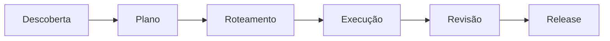

<div align="center">

# Skill Team

### De ideia a release — skills coordenadas para agentes de IA

[](#as-9-skills)
[](contracts/skill-team-v3.md)
[](#validação)
[](https://github.com/VIDORETTO/planning-delegation-skills/commits/main)

Um kit reutilizável que transforma intenção ambígua em plano executável, distribui o trabalho ao modelo certo, implementa com evidência, revisa com independência e decide se está pronto para release.

[Começar](#início-rápido) · [Skills](#as-9-skills) · [Fluxo](#como-funciona) · [Validar](#validação)

</div>

---

## O que é o Skill Team

Agentes de IA costumam misturar descoberta, planejamento e código na mesma conversa. O resultado: contratos inventados, dependências puladas, “feito” sem prova e ninguém sabe onde o trabalho parou.

**Skill Team** é um conjunto de 9 skills que trabalham em cadeia. Cada uma tem um trabalho claro, entrega artefatos objetivos e passa o bastão para a próxima — sem pular etapa e sem dois escritores ao mesmo tempo.

Contrato operacional: [`contracts/skill-team-v3.md`](contracts/skill-team-v3.md)  
Catálogo: [`catalog/skills.json`](catalog/skills.json)

## Como funciona



| Etapa | Skills | Pergunta que responde |
|---|---|---|
| Descoberta | brainstorm · investigate · ux-audit | O que queremos e o que já existe? |
| Planejamento | create-spec-driven-plan | Como fazer isso de forma executável? |
| Roteamento | route-ai-work-by-capability | Quem deve fazer cada tarefa? |
| Execução | execute-routed-task | Implementar a próxima tarefa pronta |
| Qualidade | review-implementation-evidence | A evidência sustenta o “feito”? |
| Release | validate-release-readiness | Podemos lançar? |
| Manutenção | author-repository-skill | Como evoluir este próprio kit? |

O ponteiro operacional único em qualquer projeto consumidor é:

```text
docs/ai/<slug>/PROGRESS.md
```

Ele diz qual skill está ativa (`required_skill`), quem escreve agora (`writer_skill`) e qual é a próxima ação. Skills também funcionam sozinhas quando você só precisa de uma etapa.

---

## As 9 skills

### 1. `brainstorm-idea-with-user`

**Para quê:** amadurecer uma ideia vaga com o usuário até ela ficar pronta para virar plano.

**Quando usar:** produto novo, pedido ambíguo, “quero algo assim”, requisitos incompletos.

**Como pedir:**

```text
Use $brainstorm-idea-with-user para explorar esta ideia comigo até
estarmos prontos para planejar.
```

**Entrega:** `BRAINSTORM.md` + handoff `BRAINSTORM-TO-PLAN.md`

---

### 2. `investigate-existing-codebase`

**Para quê:** inspecionar o código real e trocar achismo por evidência antes de planejar mudança.

**Quando usar:** bug, feature em repo legado, refactor, auditoria técnica, “como isso funciona hoje?”.

**Como pedir:**

```text
Use $investigate-existing-codebase para mapear a arquitetura atual,
o impacto desta mudança e a evidência técnica necessária ao plano.
```

**Entrega:** `CODEBASE-INVESTIGATION.md` + handoff `CODEBASE-TO-PLAN.md`

---

### 3. `product-ux-audit`

**Para quê:** auditar a interface renderizada (fluxos, cobertura, problemas de UX) com taxonomia única.

**Quando usar:** produto vivo, preview local, protótipo navegável, revisão visual antes de replanejar.

**Como pedir:**

```text
Use $product-ux-audit neste produto. Mapeie o sitemap, cubra as telas
combinadas e produza o handoff para o plano.
```

**Entrega:** `SITEMAP.md`, `COVERAGE.md`, `UX-AUDIT.md` + handoff `UX-AUDIT-TO-PLAN.md`

---

### 4. `create-spec-driven-plan`

**Para quê:** transformar descoberta (ou brief compacto) em plano spec-driven: contratos, fases, tarefas testáveis e rastreabilidade.

**Quando usar:** depois da descoberta, ou quando o escopo já está claro e falta um plano executável por outra IA.

**Como pedir:**

```text
Use $create-spec-driven-plan com o handoff de descoberta e gere o
planejamento completo (perfil standard), pronto para roteamento.
```

Perfis: `compact` (mudança pequena), `standard` (padrão), `critical` (risco alto).

**Entrega:** docs em `plan/` + handoff `PLAN-TO-ROUTING.md`

---

### 5. `route-ai-work-by-capability`

**Para quê:** classificar cada tarefa por risco/capacidade e atribuir executor (e revisor quando preciso), sem amarrar a skill a um modelo de marca.

**Quando usar:** plano validado, com tarefas e dependências prontas para filas.

**Como pedir:**

```text
Use $route-ai-work-by-capability para classificar as tarefas,
registrar os modelos em MODEL-CAPABILITIES.md e criar as filas.
```

**Entrega:** `ROUTING.md`, `MODEL-CAPABILITIES.md` + handoff `ROUTING-TO-IMPLEMENTATION.md`

---

### 6. `execute-routed-task`

**Para quê:** implementar a próxima tarefa pronta da fila do modelo ativo — mudança mínima, checks, evidência, e parar limpo.

**Quando usar:** roteamento validado, revisões alinhadas, um único escritor ativo, tarefa com dependências satisfeitas.

**Como pedir:**

```text
Use $execute-routed-task. Sou o modelo X. Continue a partir do
PROGRESS.md e execute o próximo lote autorizado da minha fila.
```

**Entrega:** evidência por tarefa + handoff `IMPLEMENTATION-TO-REVIEW.md` (quando a revisão for exigida)

---

### 7. `review-implementation-evidence`

**Para quê:** revisar de forma independente se a implementação realmente cumpre o plano — sem “consertar” em silêncio.

**Quando usar:** política do projeto exige review, hard gate, ou dúvida se o “feito” tem prova.

**Como pedir:**

```text
Use $review-implementation-evidence na tarefa F02-004. Aprove,
peça correção limitada ou escale — sem implementar o fix.
```

**Entrega:** `REVIEW.md` + handoff para release ou de volta à implementação

---

### 8. `validate-release-readiness`

**Para quê:** decidir, com evidência, se o release pode sair — testes, reviews, segurança, migração, rollback, observabilidade.

**Quando usar:** trabalho da release concluído (ou quase) e alguém precisa de um go / no-go explícito.

**Como pedir:**

```text
Use $validate-release-readiness e produza a decisão de release
com blockers claros. Não faça deploy.
```

**Entrega:** `RELEASE-READINESS.md` + atualização do ponteiro de release no `PROGRESS.md`

---

### 9. `author-repository-skill`

**Para quê:** criar, atualizar, fundir, dividir ou auditar skills **deste** repositório, mantendo catálogo, contrato e validadores.

**Quando usar:** manutenção do Skill Team — não é parte do fluxo de produto do usuário final.

**Como pedir:**

```text
Use $author-repository-skill para adicionar/atualizar a skill X,
checando overlap no catálogo antes de criar algo novo.
```

---

## Início rápido

### 1. Clone

```bash
git clone https://github.com/VIDORETTO/planning-delegation-skills.git
cd planning-delegation-skills
```

### 2. Instale as skills no seu agente

Adapters por ferramenta:

| Ferramenta | Guia |
|---|---|
| Codex | [`adapters/codex/README.md`](adapters/codex/README.md) |
| OpenCode | [`adapters/opencode/README.md`](adapters/opencode/README.md) |
| Cursor | [`adapters/cursor/README.md`](adapters/cursor/README.md) |

Exemplo Cursor (PowerShell):

```powershell
Copy-Item .\skills\* "$env:USERPROFILE\.cursor\skills" -Recurse -Force
```

### 3. Escolha o ponto de entrada

| Situação | Comece com |
|---|---|
| Ideia nova / ambígua | `brainstorm-idea-with-user` |
| Código existente a entender | `investigate-existing-codebase` |
| UI/produto a auditar | `product-ux-audit` |
| Já tem contexto, falta plano | `create-spec-driven-plan` |
| Plano pronto, falta filas | `route-ai-work-by-capability` |
| Filas prontas, implementar | `execute-routed-task` |

### 4. Continuidade

Depois do primeiro ciclo, mensagens curtas bastam:

```text
Continue.
```

O agente lê `PROGRESS.md` e sabe a skill exigida, o escritor ativo e a próxima ação.

---

## Validação

Só biblioteca padrão do Python.

```bash
# Repositório inteiro (catálogo, links, overlap, contratos)
python scripts/validate_repository.py

# Por skill, em um projeto consumidor
python skills/create-spec-driven-plan/scripts/validate_plan.py docs/ai/<slug>
python skills/route-ai-work-by-capability/scripts/validate_routing.py docs/ai/<slug>
```

Testes:

```bash
python -m unittest discover -s tests
```

---

## Princípios (versão curta)

1. **Especificação antes do código** — contratos e aceites vêm primeiro.
2. **Um ponteiro** — `PROGRESS.md` é a fonte operacional; `AGENTS.md` só indexa.
3. **Skill certa, sem atalho** — `required_skill` não se ignora.
4. **Um escritor por vez** — evita corrida e estado inconsistente.
5. **Modelos são configuração do projeto** — a skill classifica papéis; o nome do modelo fica em `MODEL-CAPABILITIES.md`.
6. **Conclusão exige evidência** — “feito” sem prova não conta.
7. **Núcleo portátil** — adapters são opcionais; o core não depende de uma IDE.

---

## Estrutura do repositório

```text
planning-delegation-skills/
├── README.md
├── AGENTS.md
├── contracts/          # skill-team/v3 + schemas
├── catalog/            # registro das skills
├── skills/             # as 9 skills
├── adapters/           # Codex / OpenCode / Cursor
├── scripts/            # validadores do repositório
├── tests/              # unit + integração
└── docs/migration/     # v2 → v3, mapa do advisor-planner
```

Migração a partir de `planning-delegation/v2`:

```bash
python scripts/migrate_v2_to_v3.py docs/ai/<slug> --dry-run
```

---

## Contribuindo e segurança

- Contribuição: [`CONTRIBUTING.md`](CONTRIBUTING.md) — use `author-repository-skill` antes de criar skill nova.
- Segurança: [`SECURITY.md`](SECURITY.md) — sem secrets em fixtures; sem instalar pacotes com `--break-system-packages`.

---

<div align="center">

**Descubra com evidência. Planeje com contratos. Delegue com critérios. Entregue com prova.**

[Voltar ao topo](#skill-team)

</div>
